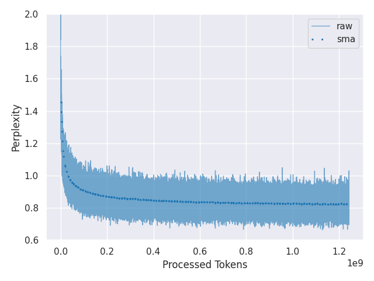

# Generative AI from Scratch

This repository aims to cover minimal codes for generative models for an educational purpose. They basically depend on PyTorch 2.0, no HugginFace transformers.

To begin with, I included the code to train a 51M-parameter language model. I will add image generation and more features in the future.

## Prerequisites

This repository is tested on:

- Python 3.10.12
- Poetry 1.6.1
- NVIDIA V100 GPU
- CUDA 11.8

For the Python packages, please refer to [pyproject.toml](pyproject.toml).

## Text Generation

I trained a 51M-parameter language model on 1B tokens from BookCorpus. The training took around 20 hours with a single V100 GPU, which cost around $50. The final model achieved the perplexity of 0.83.



### Training Procedure

To create a tokenizer, run:

```sh
poetry run python generative_ai/scripts/create_tokenizer.py
```

To launch training, run:

```sh
poetry run python generative_ai/scripts/train.py
```

To generate sentences with pretrained model, run:

```sh
poetry run python generative_ai/scripts/generate.py  --prompt "life is about"
```
